<div align="center">



<br/><br/>

<a href="https://overdusts.xyz"></a>
<a href="https://overdusts.github.io/themery/"></a>
<a href="https://discord.com/users/285253310921834497"></a>


[](https://overdusts.xyz)

</div>

```ts
const sarthak = {
  alias:    "Overdusts",
  base:     "India",
  stack:    ["Python", "TypeScript", "JavaScript", "C#", "Rust", "Go"],
  focus:    ["automation", "web3", "cybersec"],
  shipping: "themery — a living gallery of 2026 UI/UX themes",
};
```

<br/>

<div align="center">

### `// featured`

<table>
  <tr>
    <td align="center" width="33%">
      <a href="https://github.com/Overdusts/themery"><b>themery</b></a>&nbsp;<a href="https://overdusts.github.io/themery/"></a>
      <br/><sub>A living UI/UX theme gallery — 16 live demos of 2026 design aesthetics, zero build step</sub>
      <br/><sub><code>HTML/CSS/JS</code></sub>
    </td>
    <td align="center" width="33%">
      <a href="https://github.com/Overdusts/Spotify-Lyrics-Overlay"><b>spotify-lyrics-overlay</b></a>
      <br/><sub>Transparent always-on-top overlay with karaoke-style word-by-word synced lyrics</sub>
      <br/><sub><code>Python · PyQt5</code></sub>
    </td>
    <td align="center" width="33%">
      <a href="https://github.com/Overdusts/mournbit"><b>mournbit</b></a>
      <br/><sub>Crypto trading terminal & real-time market analytics — web charts + Discord signals</sub>
      <br/><sub><code>Next.js · Python</code></sub>
    </td>
  </tr>
  <tr>
    <td align="center" width="33%">
      <a href="https://github.com/Overdusts/dashboard"><b>dashboard</b></a>
      <br/><sub>Personal dashboard — live Discord status, Spotify, GitHub projects, particle effects</sub>
      <br/><sub><code>JavaScript</code></sub>
    </td>
    <td align="center" width="33%">
      <a href="https://github.com/Overdusts/expense-manager"><b>expense-manager</b></a>
      <br/><sub>Discord expense bot — budgets, income, crypto & friend exchanges via buttons + modals</sub>
      <br/><sub><code>JavaScript · Discord</code></sub>
    </td>
    <td align="center" width="33%">
      <a href="https://github.com/Overdusts/roblox-multi-instance-launcher"><b>multi-instance-launcher</b></a>
      <br/><sub>Roblox multi-instance launcher with FFlag optimization, mutex bypass & anti-AFK</sub>
      <br/><sub><code>C#</code></sub>
    </td>
  </tr>
</table>

### `// stack`


<br/>

### `// stats`

&nbsp;


<br/><br/>

<picture>
  <source media="(prefers-color-scheme: dark)" srcset="https://raw.githubusercontent.com/Overdusts/Overdusts/output/github-snake-dark.svg" />
  <source media="(prefers-color-scheme: light)" srcset="https://raw.githubusercontent.com/Overdusts/Overdusts/output/github-snake.svg" />
  
</picture>

<br/><br/>

<details>
  <summary><code>🎧 now playing</code></summary>
  <br/>
  <a href="https://spotify-github-profile.kittinanx.com/api/view?uid=31tauhivjyqd2tc3stgw5nzj5nza&redirect=true">
    
  </a>
</details>

<br/>

<sub><code>make something weird today</code></sub>

</div>
