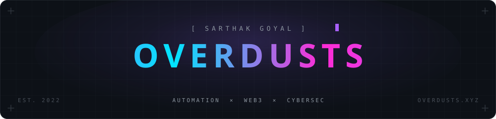

  

 

2nd-year CS student building crypto tools, Discord bots, and on-chain monitors. Currently going into Web3 security.

**Selected work**

- [**coinjury**](https://github.com/Overdusts/coinjury) — puts Solana memecoins on trial: keyless rug-risk checks + an AI verdict
- [**mournbit**](https://github.com/Overdusts/mournbit) — crypto trading terminal + analytics
- [**Safedeal**](https://github.com/Overdusts/Safedeal) — P2P crypto escrow bot for Discord
- [**magnolia**](https://github.com/Overdusts/magnolia) — live exchange portfolio dashboard

 

  
<samp>◷ on the wire — now playing</samp>

   
  

 

<code>Set in the broadsheet · MMXXVI · overdusts.com</code>

